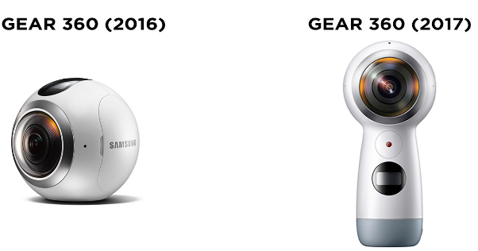
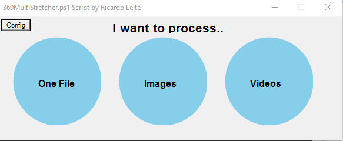

# 360MultiStretch.ps1

In 2020 Samsung retired the ActiveDirector software for the Samsung gear 360 cameras,
used for anoramic convertion/stitching/stretching, so it was no longer possible to online activate it.

This is a windows Powershell script to convert dual fisheye from Samsung Gear360 to equirectangular format. 

The output videos can be played 360 with VLC (both computer/Smartphones or uploaded to youtube, and the 360 images can be viewed on android gallery on smartphones.

## Requirements

ffmpeg and exiftool

